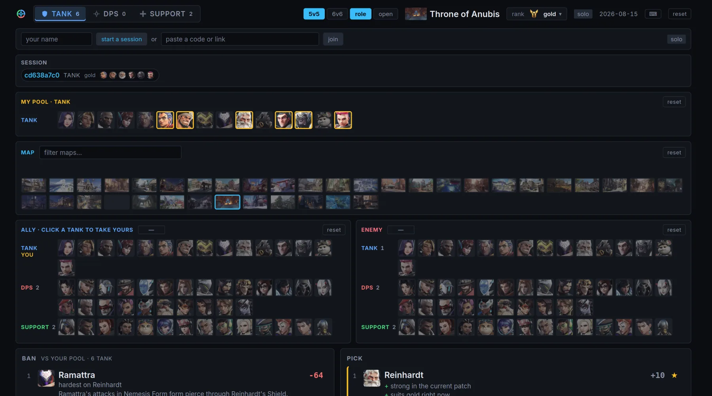

<p align="center">
  
</p>

<p align="center"><strong>Overwatch 2 draft assistant.</strong><br>
Ranks every hero in your role against the enemy team you are actually facing,
and shares one draft with your whole team by session code.</p>

<p align="center">
  
</p>

---

Hero select is seconds long, so the scoring engine is compiled into the client
and runs locally on every pick. The sync server only moves session state between
the people drafting; it is never in the path between a keystroke and an answer.

| Crate | What it is |
| --- | --- |
| `overwatch-core` | Domain model and scoring engine. I/O-free, so it compiles to `wasm32`. |
| `overwatch-data` | Loads the committed dataset in `data/` into a `Dataset`. |
| `overwatch-ingest` | Regenerates `data/*.toml`, the art assets, and the brand rasters. |
| `overwatch-server` | Sync socket, and serves the wasm bundle. |
| `overwatch-web` | The draft screen (Dioxus). |

## How a pick is scored

Every hero in the role you are picking gets a weighted sum of eight terms. These
are shipped constants, and the measurement behind each one is in the doc comment
beside it in [`score.rs`](overwatch-core/src/score.rs). There is no settings
screen: they round-trip through the stored profile, so changing one means editing
that entry by hand, and they load unclamped.

| Term | Weight | What it reads |
| --- | --- | --- |
| `counter` | 1.00 | matchups against every enemy entered, weighted by role pairing |
| `personal` | 0.60 | your own comfort, from the heroes you mark on the pool board |
| `map` | 0.25 | hero/map affinity |
| `shape` | 0.25 | dive / poke / brawl against the enemy comp's shape |
| `side` | 0.20 | the attack/defend lean, on the maps that have sides |
| `synergy` | 0.20 | rated duos with the allies already locked |
| `base` | 0.15 | current patch strength, from win rate across the whole ladder |
| `rank` | 0.15 | how far that moves at the rung you selected, if you selected one |

Comfort sitting second is deliberate: a hero you play well but is countered
usually beats the "correct" pick you cannot play. You set it on the **my pool**
board — a hero you mark is worth `0.12`, which is deliberately less than the
`0.15` a swap has to clear, so marking a hero can never on its own tell you to
abandon a pick that is working.

Four things about the arithmetic worth knowing before you trust a number:

- **Enemy picks are not counted equally.** `EnemyRoleWeights` in
  [`score.rs`](overwatch-core/src/score.rs) weights each enemy by
  `[your role][their role]` — the enemy tank carries 2.2 against your tank, the
  enemy supports 0.6 against your support. It is the largest single lever in the
  scorer: flattening it to a plain average changes the top recommendation for
  31% of tank drafts. The ban list reads the same table rescaled so its three
  columns are comparable, because it is the one place heroes of *different* roles
  are ranked against each other — without that, a support could not make the list
  however badly your team lost to it.
- **An unrated pair is left out of the mean, never folded in as zero.** "Nothing
  known" and "rated dead even" are different answers and the scorer keeps them
  apart, in the counter mean, the synergy mean, the ban list and the shape read
  alike.
- **Two terms can only ever argue *for* a hero.** Map affinity and synergy are
  positive-only, because the sources publish each hero's best maps and top duos
  and nothing else. A zero there means "no data", which is why both are weighted
  below the counter term.
- **Every recommendation shows its work.** Up to three reason lines, sorted by
  how much each actually moved the score, so the answer is arguable rather than
  oracular.

The same engine answers two other questions: **threats**, which enemy is beating
you and by how much, and **bans**, which hero to remove given everything the
whole team has told it about what they play.

## Where the numbers come from

The dataset is scraped offline by `overwatch-ingest` and committed to `data/` as
TOML. **Nothing in the app talks to these sites at runtime** — the generated
tables are compiled into the wasm bundle, so a draft screen makes no network
request to score anything.

| Source | What it provides |
| --- | --- |
| [OverFast API](https://overfast-api.tekrop.fr) | the hero roster, the map list, and the portrait/screenshot URLs |
| [counterpickgg](https://counterpickgg.com) | hero matchups with written rationale, win and pick rates, best maps |
| [counterwatch](https://www.counterwatch.gg) | hero matchups, win rates, best duos, win rate per rank division |
| [Blizzard hero rates](https://overwatch.blizzard.com/en-us/rates/) | first-party win, pick and ban rates, per rank division |
| [overpicker](https://overpicker.com) | recorded for comparison, **deliberately not used** |

Matchups are a weighted average of **counterpickgg 0.75 and counterwatch 0.25**,
renormalised over whichever of the two has an opinion about a given pair.
counterpickgg dominates because it is the only complete, fine-grained source and
it carries the reasoning; counterwatch is duel-derived rather than
opinion-derived and independently agrees with it (Pearson r = +0.45 over the 1,113
pairs both cover), so it refines rather than drives.

counterwatch contributes three different kinds of reading, and the difference is
worth knowing. For 530 pairs it publishes an actual counter rating, measured from
duel outcomes with a sample size beside it, and that number is used directly. For
641 more it states a win-probability swing in the row tooltips of its counters
page — the same quantity at coarser precision, agreeing with the rating to
r = +0.98 where both exist. Only the remaining 48 are converted from a position in
a ranked list, by interpolating down from whatever that list *did* publish a number
for. A rank is the weakest of the three and the file does not distinguish them, so
`just ingest-counters` reports the split on every run.

Blizzard's endpoint feeds three different things, and only one of them is a
matchup. Its win rate is **one of three evenly weighted** sources behind
[`data/strength.toml`](data/strength.toml) — deliberately not the 0.75/0.25 the
matchup blend uses, because there the two sources are of unequal precision and
here the three are not. Its pick rates become
[`data/prevalence.toml`](data/prevalence.toml), which discounts a ban by how rarely
the hero actually turns up, and its ban rates become
[`data/ban_rate.toml`](data/ban_rate.toml), which is the one generated file
**never** compiled into the app.

That last one is deliberate and it is load-bearing. The ban rate is the yardstick
the ban list is judged against, so scoring on it would make the acceptance test
circular — a list tuned to predict published bans, graded on how well it predicts
published bans. `the_ban_rate_table_never_reaches_the_bundle` greps the loader to
keep the file out of the bundle, and
`the_patch_rung_at_grandmaster_moves_toward_what_grandmasters_actually_ban` is what
reads it.

overpicker is excluded on evidence rather than by taste: its published matrix has
no measurable relationship to either other source — r = −0.04 against
counterpickgg and −0.07 against counterwatch, in both orientations. Two sources
that independently agree with each other and disagree with a third is evidence
about the third. Its numbers are still recorded in every row so the judgement
stays visible and reversible.

**Rank slices only exist for win rate.** [`data/strength_by_rank.toml`](data/strength_by_rank.toml)
holds, per hero, how far its strength moves from the ladder average on each of
the eight divisions — a median of 4.7 win-rate points between Bronze and
Grandmaster, against an all-ranks between-hero band only 10.7 points wide.
Nothing else is sliced that way, because nothing else is published that way:
counterwatch's rank filter is not URL-addressable and its counter and duo pages
carry no per-division breakdown, and Blizzard publishes one row per hero and
never a pair. So picking a rank changes which patch-strength number is read and
changes nothing about matchups, synergies, maps or sides.

The two rank sources are combined as a shift measured *within each source* —
Blizzard against its own all-ranks table, counterwatch against the figure on the
same page — never as a difference across the two, which would be part rank effect
and part instrument disagreement. counterwatch's contribution is weighted by
`n/(n+400)`, its own published shrinkage constant, so the divisions it barely
measured (a median of 263 tracked matches at Emerald against 18,536 at Gold)
count for what they measured and not for the prior they were shrunk toward. The
result is smoothed once across adjacent divisions with a `[1, 2, 1]` kernel,
which leaves a straight trend exactly where it was and cancels a one-division
spike outright.

Every entry in [`data/matchups.toml`](data/matchups.toml) carries the per-source
values it was blended from, so any number can be traced back to the sites that
produced it. The counterwatch column has three tiers, in order of how directly the
site states them: a published counter rating for the ten most lopsided matchups on
each hero's stats page, a published win-probability swing in the row tooltips of
each hero's counters page, and — for what is left — an interpolation from where a
hero sits in a ranked list. The second tier covers 641 pairs and the third only 48;
before the swings were read it was 265. Where the two trusted sources disagree sharply the row is flagged
**and pulled toward even**, rather than quietly averaged, and the app says so: the
matchup carries a `disputed` tag on the matchups panel and a marker on the reason
line that argues from it.

The written rationale on a row is quoted from counterpickgg verbatim, and the row
says so: a quoted line closes with a `counterpickgg` marker, and everything else
on screen is the app's own wording over its own arithmetic. The two are also told
apart typographically — the app writes in lowercase with no terminal full stop and
the quotations are punctuated sentences — which is what carries the distinction on
a line whose marker has wrapped out of view.

Coverage is uneven and the app says so out loud rather than in this file: **533 of
the 1,330 rated pairs carry a published sentence**, and the "where these numbers
come from" panel at the foot of the app counts both figures off the matrix in the
bundle it is running, so the claim cannot go stale the way a number typed into copy
does.

Both the flag and the correction belong to the pair rather than to one direction
of it. The second source rates only part of each hero's list, so it usually states
a contradiction once — and the mirror row used to keep both its full magnitude and
a clean flag, which is how a matchup the data called soft could still be scored as
a near-maximum edge. Each source is therefore averaged across both directions
before the two are compared, and the same factor is applied to both rows. Tracing
a value back by hand takes the mirror row's columns as well as its own.

**Not all of it is measured.** [`data/archetype.toml`](data/archetype.toml)
(dive/poke/brawl) and [`data/side.toml`](data/side.toml) (attack/defend lean) are
hand-curated judgement with a written note per entry and no source behind them —
no site publishes either. `synergy.toml` and `matchups.toml` both carry a
hand-written `curated` column that overrides the generated one, for pairs the
sources do not list or read wrongly. These are opinions, and the files say so on
the first line.

The matchup lane exists because every counter source measures a **duel**, which is
the wrong instrument for a fight decided by an ability rather than an aim contest —
a cleanse landing on a nade, a lamp eating a burst combo, a pull taking a target
out from under a dive. Those pairs come back rated dead even, and an even pair
argues for nothing, which is why the ban list used to have no supports on it at
all. A curated row is written on both directions of the pair with opposing signs,
carries a note saying which interaction it is about, and never reaches the extremes
the measured columns do.

The scrape is polite: one request every 1.1 seconds, and a user-agent that names
the project and a contact address. The header of the app shows the date the
counter data was last ingested, so its age is visible while you use it.

## Prerequisites

- **Rust 1.88 or newer** — the workspace sets `rust-version = "1.88"`.
- **The `wasm32-unknown-unknown` target**, which the client compiles to:

      rustup target add wasm32-unknown-unknown

- **`dx`, the Dioxus CLI** — `just build-web` (and therefore `just serve`)
  shells out to `dx build`. Without it the recipe fails with
  `dx: command not found`. Install it pinned to the same version as the
  `dioxus` dependency, currently 0.7.10:

      cargo install dioxus-cli@0.7.10 --locked

  A CLI whose minor version disagrees with the `dioxus` crate is not expected to
  work, so bump both together.

- **`just`**, to run the recipes below.

## Running it

    just serve   # build the release bundle, then serve it and the sync socket
    just dev     # client only, with hot reload and no sync
    just url     # print the addresses to open

`just serve` prints both a `localhost` address and the LAN address the other
people should open. `just --list` shows every recipe, including the `ingest-*`
family that regenerates `data/`.

### Drafting together

One person starts a session and gets a code built to survive being read aloud
over voice chat — `brave-otter-41`. Everyone else joins by typing the code, by
opening the link, or by pointing a phone at the QR. The join box takes a bare
code, a `#code`, or a whole pasted URL, so anything link-shaped works.

What is shared and what is not is the whole design:

- **The board belongs to everybody.** Map, side, format and the enemy team are
  typed once by whoever reads the enemy comp first, and land on every screen.
  That is the feature: four people stop retyping the same five heroes.
- **Your seat belongs to you.** Your locked hero is yours alone — nobody can move
  it — and it appears on everyone else's roster as their ally without anyone
  entering it by hand.
- **Your hero pool travels with your seat**, so the ban list defends the whole
  team rather than only the person reading it.
- Teammates who are not running the app are entered by hand and shared like
  everything else.
- Two people taking the same hero get a `contested ×2` badge. The game will
  refuse it in a moment; the point is that the two of you find out here first.
- A teammate who drops stays on the roster, dimmed and marked offline, rather
  than vanishing mid-draft. A reload reclaims your seat for ten minutes.

Every client derives its own draft from the shared state and scores it locally,
so the socket never sits between a click and an answer — and losing the
connection degrades to solo rather than breaking.

There is no authentication and none is implied. A session code is a convenience
for finding the right draft, not a secret.

### Keyboard shortcuts

Five chords, on one rule: **ctrl builds, alt costs.** Everything that gives
something up sits behind alt, so reaching for it is the guard against a stray
keypress throwing away the picks you just entered. Everything else on the screen
is a click or a tap.

| Chord | What it does |
| --- | --- |
| `^L` | take the top pick |
| `⌥R` | next role |
| `⌥W` | record a win |
| `⌥L` | record a loss |
| `Esc` | clear the picks |

They match on the physical key rather than the character it produced, so a
non-US layout, Caps Lock and macOS's `⌥W` → `∑` cannot break them.

### Configuration

The server reads three optional environment variables:

| Variable | Default | Meaning |
| --- | --- | --- |
| `OVERWATCH_ADDR` | `0.0.0.0:8080` | A full socket address. A bare port or bare IP does not parse and silently falls back to the default. |
| `OVERWATCH_ASSETS` | `target/dx/overwatch-web/release/web/public` | The bundle to serve. Relative to the working directory. |
| `OVERWATCH_MATCH_LOG` | `data/matches.jsonl` | Where match results are appended. **Set it to the empty string to switch the match log off**, which makes `/api/matches` a 404 in both directions. |

> **On exposing it.** There is no authentication: `POST /api/session` mints rooms
> and `/ws/{room}` is joinable by code with no rate limiting. Sessions are capped
> at 1024, and a code nobody opens is dropped after two minutes and evicted first
> when the map is full, so minting them cannot push a real team out — but nothing
> caps concurrent sockets.
>
> The match log is the part that is actually personal — `GET /api/matches`
> returns the whole history and `POST` appends to it — so the public deployment
> runs with `OVERWATCH_MATCH_LOG=""` and the endpoint closed. Anything else you
> put behind a public address needs the rest dealt with first.

`GET /health` answers with the running commit and a census of the sessions:

```
$ curl -s localhost:8080/health
{"status":"ok","rooms":7,"claimed":3,"active":2,"connected":5,"capacity":1024,"build":"7a03cac"}
```

`rooms` against `capacity` is the memory picture. The other three separate the
states a room can be in, and the gaps are the useful part: `rooms` well above
`claimed` is codes being minted and never opened, `claimed` above `active` is
drafts riding out their grace period, and `connected` counts people rather than
sessions. Sweeping is lazy, so an idle server keeps reporting rooms whose time
is up until the next person creates or joins one — the memory is still held at
that point, so the count is honest rather than stale.

## Deployment

`minmax.watch` runs a container built by
[`.github/workflows/ci.yml`](.github/workflows/ci.yml) on every push to `main`
and published to `ghcr.io/maikbuse/minmax-watch:<sha>-amd64`. The deployment
manifests live outside this repository.

The [`Dockerfile`](Dockerfile) reproduces the `build-web` recipe from the
`justfile`. **The two have to stay in step** — anything added to the recipe's
list of root-path assets has to be added to the Dockerfile too, or it works
locally and 404s in production. The image additionally brotli-compresses the
bundle, which `just serve` does not do.

## Checks

    just check   # everything CI would run: fmt-check, lint, test, wasm-check

## Brand

The palette, type scale and logo rules live in [docs/BRAND.md](docs/BRAND.md).
`assets/icon.svg` and `assets/og.svg` are the source artwork; every PNG and the
favicon are derived from them:

    just brand-icons   # rasterise the SVGs; writes only what actually changed

## License

MIT — see [LICENSE](LICENSE).

Inter is bundled under the SIL Open Font License 1.1
([overwatch-web/assets/fonts/LICENSE-Inter.txt](overwatch-web/assets/fonts/LICENSE-Inter.txt)).

The matchup data and the rationale text in `data/matchups.toml` are
counterpickgg's; the win rates and duo ratings are counterwatch's; the roster and
map list come from the OverFast API. The MIT licence covers the code in this
repository, not those sources.

Not affiliated with or endorsed by Blizzard Entertainment. Overwatch, and the
hero and map artwork regenerated by `just ingest-art`, are Blizzard's.
